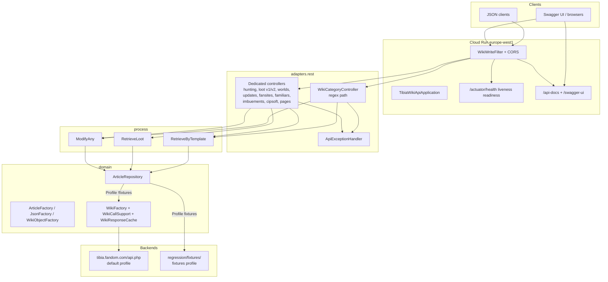
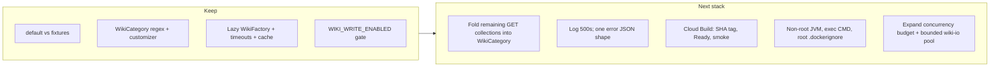

# TibiaWikiApi architecture and quality review

**Date:** 2026-08-24  
**Scope:** Kotlin / Spring Boot 4.1.1 / JDK 25 → Docker → Cloud Run / Cloud Build / GitHub Actions  
**Public API:** https://tibiawiki.dev  
**Repo SHA reviewed:** `040f4c3` (`master` at review start)  
**This PR:** docs only. No app rewrite.

Recent pain used as **anchors**, not the whole review: Boot 4 + Kotlin rewrite, SonarCloud, multi-agent PR fan-out, `gh-stack`, Cloud Run startup-probe failures (`LOGGING_JSON` / Logback; multi-ctor bean pickup), Swagger 200≠render (OpenAPI 3.1 vs UI 3.0), incomplete docs catalog for regex `WikiCategory` routes. Hotfixes already on `master`: `DefaultProfileWikiBeansIT`, `LoggingJsonActuatorIT`, `SwaggerUiIT`, `WikiCategoryOpenApiCustomizer`, regression `smoke:docs`.

**In-flight overlap — do not fight it:** [PR #444](https://github.com/benjaminkomen/TibiaWikiApi/pull/444) (`Fail closed on Cloud Run Ready plus prod docs smoke`) hardens `scripts/deploy.sh` + `AGENTS.md` only. It does **not** change `cloudbuild.yaml`. Findings F-01 and F-02 are written so #444 can land first; the remaining production gap is Cloud Build.

---

## Executive summary

- The app is a thin public read API over TibiaWiki/Fandom. Layering is package-by-layer (`adapters.rest` → `process` → `domain.repositories`), with a real fixtures profile that never constructs jwiki. That split is the most important architectural win of the 2026 rewrite.
- Production still ships through `cloudbuild.yaml`, which deploys an untagged `:latest` GCR image, then `gcloud alpha run services update-traffic --to-latest`, with **no Ready wait and no docs/health smoke**. A revision can be Ready (actuators up) while Swagger is broken. That is the class of failure that already happened. PR #444 fixes the **manual** path only.
- Default-profile boot is now lazy and probe-safe (`WikiFactory` on first use, `LOGGING_JSON` mapped before Logback). Those hotfixes are real. `docker/README.md` still claims jwiki talks to Fandom during context creation — it does not, and that stale sentence will mislead the next outage.
- `ApiExceptionHandler.handleUnexpected` maps every uncaught exception to an empty HTTP 500 and **logs nothing**. Combined with `management.endpoint.health.show-details=never`, production 500s are undebuggable from logs or clients.
- The Docker image is a multi-stage Boot jar (good) that still runs as **root**, uses **shell-form `CMD`** (Cloud Run SIGTERM hits `sh`, not the JVM), and has a `.dockerignore` in `docker/` that **is not used** because the build context is the repo root.
- Wiki I/O uses an **unbounded cached thread pool** plus an in-process Guava cache that dies on every cold start (`min-instances` is unset → 0). `?expand=true` is capped at 5000 pages but is otherwise unauthenticated and un-rate-limited on a public scrape API.
- Kotlin is mostly idiomatic data classes + sealed `ModifyResult`. Residues from the Java years remain: Groovy `build.gradle`, `java.util.Optional` + Vavr tuples in parsing, `WikiClientProperties` as a mutable bean, `WikiObjectFactory` returning `Stream`, six near-identical dedicated controllers that are not in `WikiCategory`.
- CI is two jobs (`buid.yml` + `api-regression.yml`) with Gradle via `actions/setup-java` `cache: gradle` (not `gradle/actions/setup-gradle`), Sonar with **no quality-gate wait**, `bun-version: latest`, and no dependency CVE gate. Tests are a pyramid with a fat middle: most “ITs” are `@SpringBootTest` + `@MockitoBean`. The fixtures + smoke:docs path is the actual contract test.
- Security posture is pragmatic for a public GET API (writes gated, CORS GET-only, actuators locked down). Missing: security headers, rate limits, Secret Manager for wiki bot credentials, OWASP/Snyk in CI. Do not add a user-authn product; do add abuse controls and fail-closed deploy.

---

## Architecture

### Current shape

**Profiles**

| Profile | `ArticleRepository` | Fandom | Used by |
| --- | --- | --- | --- |
| default (Cloud Run, `bootRun`) | `JwikiArticleRepository` | lazy, on first wiki call | production |
| `fixtures` | `FixtureArticleRepository` | never constructed | GHA `api-regression.yml`, `FixturesProfileIT`, local goldens |

**What is actually good**

- One regex controller for 18 catalog collections (`WikiCategory` + `WikiCategoryController`) instead of 18 copy-paste classes. Hunting places (`/**` names with slashes) and loot (custom namespace + `Loot2`/`Loot2_RC`) are correctly special-cased.
- Wiki client construction is lazy (`WikiFactory.get()`), timed out and jitter-retried (`WikiCallSupport`), and short-TTL cached (`WikiResponseCache`). Process start no longer depends on Fandom. That was the Boot 4 / Cloud Run lesson.
- Writes are off on Cloud Run (`WIKI_WRITE_ENABLED=false`) and gated by a timing-safe token compare when enabled. `ModifyAny` stays for a future bot; the public site cannot mutate the wiki.
- OpenAPI is pinned to 3.0 (`springdoc.api-docs.version=openapi_3_0`) and `WikiCategoryOpenApiCustomizer` clones the regex template onto concrete `/api/{path}` entries so Swagger UI is usable.

**Where the shape fights itself**

- `domain` is not a domain. `JwikiArticleRepository` and `FixtureArticleRepository` live under `domain.repositories` and import `com.tibiawiki.config.WikiClientProperties`. Spring `@Repository` / `@Service` / `@Component` sit on parsing factories. Hexagonal language (`adapters`) is cosmetic.
- Six dedicated collection controllers (`Worlds`, `Updates`, `Fansites`, `Familiars`, `Imbuements`, `CipsoftMembers`) are the same `RetrieveByTemplate` wrapper `WikiCategory` already is. They exist because they were added as separate issues (#408, #416) after the generic adapter. They are not in the regex, so `WikiCategoryOpenApiCustomizer` does not own them (they already have `@Tag`). The catalog is two systems.
- `RetrieveByTemplate` still carries alias methods (`names` / `asJson` / `getJson`) from the generalization PR. Dedicated controllers use the aliases; `WikiCategoryController` uses the generic names.
- `WikiObjectFactory.createWikiObject` and `WikiObjectMixin` do not know `CipsoftMember`, `Fansite`, `Familiar`, `Imbuement`, `Update`, or `World`. PUT for fansites/cipsoft works because those controllers bind the concrete type. Any path that goes through the factory/`templateType` mixin will silently drop those types.
- Error model is ad hoc: 404 empty body, 400 `ValidationErrorResponse`, 503 `{error, message}`, 413 `{error, message, requested, maxPages}`, 500 empty body. No RFC 7807 `ProblemDetail`. Fine for a scrape API; painful for clients.

### Recommended target (incremental — not a rewrite)

Do **not** introduce packages like `application` / `hexagon` / modules until the remaining copy-paste controllers and the Cloud Build gate are gone. One concern per PR; see [Suggested follow-up PR sequence](#suggested-follow-up-pr-sequence).

---

## Findings

| ID | Severity | Area | Finding | Evidence | Recommendation | Effort |
| --- | --- | --- | --- | --- | --- | --- |
| F-01 | **P0** | Cloud Run / Cloud Build | Merge-to-prod path does not fail closed on Ready **or** docs smoke. `gcloud run deploy` is followed by `gcloud alpha run services update-traffic --to-latest` with no wait, no `smoke:docs`, no SHA tag. A revision can pass Actuator probes and still serve a Swagger UI that does not render (the Aug 2026 200≠render failure). PR #444 only hardens `scripts/deploy.sh`. | `cloudbuild.yaml` lines 11–19; contrast `scripts/deploy.sh` (pre-#444: two lines, no probes/env). | Land #444. Then add the same Ready-then-`smoke:docs` gate to `cloudbuild.yaml` (or stop using Cloud Build for deploy and make `deploy.sh` the only path). Drop `gcloud alpha` traffic if deploy already sends 100%. Tag `$COMMIT_SHA` **and** `:latest`. | M |
| F-02 | **P0** | Cloud Run / deploy | Manual `deploy.sh` (until #444) does not set `LOGGING_JSON=true`, `WIKI_WRITE_ENABLED=false`, or the startup/liveness probes that `cloudbuild.yaml` sets. `gcloud run deploy` without those flags can leave a new service unprobed / unlogged; on an existing service flags usually persist, which is an implicit contract nobody wrote down. | `scripts/deploy.sh` vs `cloudbuild.yaml` `--update-env-vars` / `--startup-probe` / `--liveness-probe`. | After #444: make `deploy.sh` pass the **same** env and probe flags as `cloudbuild.yaml`. One source of truth (script *or* yaml, not drift). | S |
| F-03 | **P1** | Spring / observability | `ApiExceptionHandler.handleUnexpected` returns empty 500 and logs nothing. Unit test asserts the empty body. Production 500s from parser bugs or unexpected jwiki failures are invisible. | `src/main/kotlin/com/tibiawiki/adapters/rest/ApiExceptionHandler.kt` `handleUnexpected`; `ApiExceptionHandlerTest.unexpectedExceptionMapsTo500WithoutBody`. | Log at ERROR with the exception. Return a small JSON `{error:"internal"}` (do not leak `e.message` to clients). Keep empty body only if you have a reason — you do not. | S |
| F-04 | **P1** | Docker | Image runs as root. `CMD` is shell form, so Cloud Run SIGTERM hits `/bin/sh`, not the JVM (10s graceful shutdown is luck). `java.security.egd=file:/dev/./urandom` is a Java 8 leftover. | `docker/Dockerfile` lines 13–19. | `USER` a numeric non-root uid; `ENTRYPOINT`/`CMD` exec-form `java` with `exec`; bind `0.0.0.0` (Tomcat default is fine) and keep `-Dserver.port=${PORT}` via a tiny `entrypoint.sh` **or** Spring `SERVER_PORT`. Drop the urandom flag on JDK 25. | S |
| F-05 | **P1** | Docker | `.dockerignore` lives at `docker/.dockerignore` (contents: `Dockerfile`, `.dockerignore`, `target/`). Build context is repo root (`docker build -f ./docker/Dockerfile .`). Docker only reads **context-root** `.dockerignore`, so the file is dead. Context upload to Cloud Build includes `.git`, `regression/goldens`, tests. `COPY src ./src` still copies `src/test` and `src/integrationTest` into the builder. | `docker/.dockerignore`; `cloudbuild.yaml` line 4; `docker/Dockerfile` `COPY src ./src`. | Add a **root** `.dockerignore` (`.git`, `regression`, `src/test`, `src/integrationTest`, `.github`, `docs`, `*.md`). Copy only `src/main`. | S |
| F-06 | **P1** | Cloud Run / GCP | Images go to **gcr.io** as `:latest` only. `cloudbuild-pr.yaml` builds the same name and lists it under `images:`, so a PR trigger would push over the prod tag. No Artifact Registry (`pkg.dev`), no digest pin, no `--no-traffic` / canary / documented rollback. CPU, concurrency, min-instances, request timeout, CPU boost are unset (defaults: 1 CPU, concurrency 80, min 0, 300s). Memory 1Gi is a comment pointing at closed #399, not a measured budget. | `cloudbuild.yaml` `gcr.io/$PROJECT_ID/tibiawikiapi` + hardcoded `gcr.io/tibiawikiapi-246008/tibiawikiapi`; `cloudbuild-pr.yaml` `images:`; no `--min-instances` / `--concurrency` / `--cpu`. | Move to Artifact Registry. Tag `$COMMIT_SHA`. Confirm the PR Cloud Build trigger does **not** push `:latest` (remove `images:` or tag `pr-$SHORT_SHA`). Set concurrency from expand-memory tests; consider `min-instances=1` if cold-start + Fandom init hurts; `--cpu-boost` for startup. Canary (`--no-traffic` then 10%) is optional for this traffic level; SHA + Ready + smoke is not. | M |
| F-07 | **P1** | Wiki I/O / abuse | Public `?expand=true` is unauthenticated. Cap is 5000 pages (`wiki.expand.max-pages`), then 413. Under the cap, one request fans out to Fandom through `Executors.newCachedThreadPool` (unbounded) with a 20s timeout. Cache is in-process Guava, TTL 60s, gone on every cold start (min-instances 0). Concurrent expand of Creatures/Items can OOM the 1Gi instance and stampede Fandom. | `WikiCallSupport` lines 29–35; `WikiResponseCache`; `JwikiArticleRepository.getArticlesFromCategory`; `application.properties` `wiki.expand.max-pages=5000`. | Bound the pool (`newFixedThreadPool(n)` sized to Cloud Run CPU). Lower default expand cap or require a header for large expand. Add a cheap per-instance semaphore. Optionally `min-instances=1` so the cache survives. Do **not** add a full user authn product. | M |
| F-08 | **P1** | CI / GHA | `buid.yml` (typo, keep the name) uses `actions/setup-java` `cache: gradle` instead of `gradle/actions/setup-gradle`. Sonar runs `./gradlew sonar --info` with **no** `sonar.qualitygate.wait=true`. No OWASP/Snyk. `api-regression.yml` pins JDK but `bun-version: latest`. Two jobs both boot Gradle; regression does not reuse the Build job’s jar. Fork/PR permissions are default (no `permissions:` block). Dependabot `open-pull-requests-limit: 20` is how you got the fan-out. | `.github/workflows/buid.yml`; `.github/workflows/api-regression.yml` `oven-sh/setup-bun@v2` `bun-version: latest`; `.github/dependabot.yml`. | `gradle/actions/setup-gradle` (do not combine with `setup-java` `cache: gradle`). Fail the Build job on quality-gate. Pin bun. Add `osv-scanner` or Dependabot + `gradle-dependency-check` as a weekly job, not a 20-PR firehose — drop the Dependabot limit to 5. | M |
| F-09 | **P1** | Tests | Most `src/integrationTest` classes are `@SpringBootTest` + `@MockitoBean ArticleRepository`. That does not construct `JwikiArticleRepository`’s `@Autowired` ctor (the Boot 4 multi-ctor outage). Only `DefaultProfileWikiBeansIT` and `LoggingJsonActuatorIT` cover default/prod-like boot. Fixtures ITs + Bun goldens cover HTTP JSON. There is no test that a **default-profile** request to `/api/corpses` returns 503 (not 500, not hang) when `WikiFactory` cannot reach Fandom. | `CreaturesResourceIT` `@MockitoBean`; `DefaultProfileWikiBeansIT`; `FixturesProfileIT`; no IT stubbing `WikiFactory` failure on a real `JwikiArticleRepository`. | Keep Mockito ITs as controller/process tests (or shrink them to `@WebMvcTest`). Require default-profile ITs for bean/logging/Boot config (already in #444 `AGENTS.md`). Add one IT: default profile, `WikiFactory` made to fail, `GET /api/creatures` → 503 + `Retry-After`. | S |
| F-10 | **P1** | Security | Wiki bot credentials are a classpath `credentials.properties` read by `PropertiesUtil` (not env, not Secret Manager). `.gitignore` ignores `*.properties` except a few names; `src/test/resources/credentials.properties` is committed (`username=Foo`). `modifyArticle` logs **full page content** at INFO. No Spring Security, no security headers (`X-Content-Type-Options`, `Referrer-Policy`, `Permissions-Policy`), no rate limit. CORS can be `*` via `WIKI_CORS_ALLOWED_ORIGINS`. Actuator exposure is correctly locked to `health,info`. | `PropertiesUtil.kt`; `src/test/resources/credentials.properties`; `JwikiArticleRepository.modifyArticle` log line; `CORSResponseFilter`; `application.properties` `management.endpoints.web.exposure.include`. | Keep writes disabled on Cloud Run. If a bot ever ships: Secret Manager + env, never a file in the image. Stop logging wikitext. Add `server.servlet.session.cookie` N/A; add Boot `server.servlet.*` security headers **or** a 10-line `OncePerRequestFilter`. Rate limit is F-07. Wildcard CORS is documented; leave it opt-in. | M |
| F-11 | **P2** | Architecture / API | Catalog is split: `WikiCategory` regex (18 types) vs dedicated controllers (worlds, updates, fansites, familiars, imbuements, cipsoftmembers + hunting + loot). `WikiObjectFactory` / `WikiObjectMixin` omit the newer types. `RetrieveByTemplate` alias methods are leftover. | `WikiCategory.kt`; `WikiCategoryController` `@RequestMapping` regex; `WorldsController` et al.; `WikiObjectFactory.createWikiObject` `when`; `WikiObjectMixin` `@JsonSubTypes`. | Fold GET-only collections into `WikiCategory` (one PR per cluster if the regex gets ugly). Keep hunting (`/**`) and loot. Extend mixin + factory in the same PR as each fold so PUT/docs stay honest. Delete aliases when the last caller is gone. | M |
| F-12 | **P2** | Kotlin / Gradle | Build is Groovy `build.gradle` with `buildscript {}` + `apply plugin`, `mavenLocal()` first, no version catalog, no `gradle.properties` (`org.gradle.parallel`, configuration-cache). Kotlin 2.4.10 is forced via `resolutionStrategy` because Boot’s BOM manages 2.3.21. `java.util.Optional` + Vavr `Tuple2` remain in `TemplateUtils` / `ArticleFactory`. `WikiObjectFactory` returns `java.util.stream.Stream`. `WikiClientProperties` is a mutable class (`var`), not a data class / `@ConfigurationProperties` constructor binding. Almost every `WikiObject` field is `String?`. | `build.gradle`; `TemplateUtils.kt` imports; `WikiObjectFactory.kt` lines 36–41; `WikiClientProperties.kt`; `Creature.kt`. | Convert to `build.gradle.kts` + `libs.versions.toml` in a dedicated PR (no behavior change). Replace Optional/Vavr with nullable Kotlin in parsing (already started in `ModifyResult`). Constructor-bind `WikiClientProperties`. Do not “fix” wiki-key nullability; the payload **is** sparse wiki text. | L (Gradle DSL M; parsing residue M) |
| F-13 | **P2** | Spring | Error JSON is inconsistent (F-03). No `spring.mvc.problemdetails`. `OpenAPIConfiguration.customOpenAPI(@Autowired buildProperties)` — `@Autowired` on a `@Bean` method parameter is noise. EPP is registered **three** times (`spring.factories` + two `META-INF/spring/*.imports`). `logstash-logback-encoder` and `spring-cloud-gcp-starter-logging` are still on the classpath while JSON logs go through a hand-rolled `GcpConsoleStructuredLogFormatter` + `LOGGING_JSON`. `WikiCallSupport` uses `executor!!`. | `ApiExceptionHandler`; `OpenAPIConfiguration.kt` line 23; `src/main/resources/META-INF/spring*`; `build.gradle` deps; `GcpConsoleStructuredLogFormatter.kt`; `WikiCallSupport.kt` line 82. | One EPP registration (Boot 4 `EnvironmentPostProcessor.imports`). Delete unused logging starters if the custom formatter stays (or the reverse). Drop `@Autowired` on bean params. `executor!!` → local val after the enabled check. ProblemDetail is optional; pick one JSON error envelope and use it. | S |
| F-14 | **P2** | Tests / Sonar | JaCoCo has no coverage floor (`jacocoTestCoverageVerification` absent). Sonar coverage path is wired (`sonar.coverage.jacoco.xmlReportPaths`, IT execs merged — good) but CI does not fail on the gate. `kotlin:S6474` (Gradle verification-metadata) is globally suppressed. ktlint 14 is on, with a long list of standard rules disabled in `.editorconfig` so the rewrite would not reformat the world. | `build.gradle` `jacoco` / `sonar` blocks; `.editorconfig`. | Add a modest `jacocoTestCoverageVerification` (line, not branch) once the IT merge is trusted. Fail CI on quality-gate (F-08). Leave ktlint rule disables until a dedicated format PR; do not sneak ktlint_official into a behavior PR. | S |
| F-15 | **P2** | OpenAPI | Public Swagger on production is **intentional** (the product is the docs). Pin to 3.0 is correct for the bundled UI. `WikiCategoryOpenApiCustomizer` + `smoke:docs` + `SwaggerUiIT` are the right regression. Remaining gaps: no `paths-to-match` to hide `/actuator`; PUT 400 body schema is undocumented; hunting `/**` detail is a bad Swagger path; `index.html` points at `/swagger-ui.html` (redirect, fine). Regression `README.md` still says #405 “should flip” Loot2 goldens — #405 is merged. | `application.properties` springdoc; `WikiCategoryOpenApiCustomizer.kt`; `regression/src/smoke-docs.ts`; `regression/README.md` line about #405; `src/main/resources/static/index.html`. | Keep Swagger public. Add `springdoc.paths-to-match=/api/**` so actuators stay out of the spec. Fix the stale #405 sentence. Hunting-place names with slashes need an OpenAPI note, not a fake `{name}` if the runtime route is `/**`. | S |
| F-16 | **P3** | Hygiene | Workflow filename `buid.yml` — do not rename unless asked. `gcloud alpha` traffic. Hardcoded project `tibiawikiapi-246008` in yaml (substitutions would be cleaner). `WikiPageController` 404s both missing **and** unparsable pages. `HuntingPlacesController` parses the name with `requestUri.split("/huntingplaces/")[1]` (breaks if that token appears twice). `docker/README.md` stale Fandom-during-context-creation paragraph. Triple EPP registration (also F-13). | `AGENTS.md` (typo note); `cloudbuild.yaml`; `HuntingPlacesController.kt` `getHuntingPlacesByName`; `docker/README.md` lines 47–49. | Drive-by in the PRs that already touch those files. Do not open a “cleanup” mega-PR. | S |
| F-17 | **P3** | Kotlin | Test code uses `!!` heavily (Hamcrest + body). Production `!!` is only `WikiCallSupport.executor!!`. No coroutines (correct: jwiki/OkHttp is blocking; do not sprinkle `suspend` on controllers). | `WikiCallSupport.kt`; tests. | Leave tests. Fix the one production bang with F-13. Do not add WebFlux/coroutines unless jwiki is replaced. | S |

---

## What’s already strong

Credit this, or the next stack will re-litigate it.

- **Fixtures profile is a real offline wiki.** `FixtureArticleRepository` + `WikiClientConfiguration @Profile("!fixtures")` means CI never constructs jwiki. `FixturesProfileWikiBeansIT` asserts `WikiFactory` is absent. `api-regression.yml` boots that profile and runs goldens + `smoke:docs`. That is the right isolation for a scrape API.
- **Lazy Fandom client.** `WikiFactory` double-checked locking, init failure cooldown, `WikiUnavailableException` → HTTP 503 + `Retry-After: 5`. `DefaultProfileWikiBeansIT` boots the live repository type and hits readiness without wiki I/O. `JwikiArticleRepository` documents the Boot 4 multi-ctor trap and uses `@Autowired constructor` plus a test-only `Wiki` ctor — that comment is load-bearing, keep it.
- **LOGGING_JSON hotfix.** `LoggingJsonEnvironmentPostProcessor` is applied from `main` **before** `runApplication`, and registered as an EPP, because Cloud Run can kill the process if Logback config is wrong before Spring’s EPP runs. `LoggingJsonActuatorIT` asserts the structured format property and readiness. Do not “simplify” this until you have a failing test that says you can.
- **Docs contract tests.** `SwaggerUiIT` + `regression/src/smoke-docs.ts` check OpenAPI `3.0.n`, no Petstore, swagger-config URL, concrete `WikiCategory` paths/tags, swagger-ui assets, actuator UP. Status-200 HTML is explicitly not enough. That is how you prevent the last outage from recurring **if** prod smoke actually runs (F-01).
- **Write gate.** `WikiWriteFilter` + `WikiWriteSecurityIT` (disabled → 403, token → 401/200, timing-safe `MessageDigest.isEqual`). CORS is GET/HEAD/OPTIONS, credentials off. Actuators: `health,info` only, `show-details=never`, probe groups enabled, documented in `docker/README.md`.
- **Expand cap + 413.** `ExpandTooLargeException` mapped in `ApiExceptionHandler`; `CreaturesResourceIT` covers it. Better than unbounded expand; not a substitute for F-07.
- **JaCoCo merges IT exec files** so controllers that only have ITs are not 0% in Sonar. SonarCloud is wired (`buid.yml` + `sonar` block). ktlint is the style checker; `.editorconfig` freeze is intentional.
- **`gh-stack` is policy** in `AGENTS.md`. Use it for the follow-up sequence below. The Aug 2026 fan-out is why.
- **Dependabot** covers Gradle, GitHub Actions, and Docker (`/docker`). Keep the ecosystems; cut the PR limit (F-08).

---

## Skills used

Fetched and applied as review lenses (not templates):

| Skill | URL | Applied to |
| --- | --- | --- |
| kotlin-patterns | https://raw.githubusercontent.com/affaan-m/ECC/main/skills/kotlin-patterns/SKILL.md | Null safety, immutability, sealed `ModifyResult`, Optional/Vavr residue, Groovy vs Kotlin DSL, no coroutines |
| springboot-patterns | https://raw.githubusercontent.com/affaan-m/ECC/main/skills/springboot-patterns/SKILL.md | Layering, constructor injection, exception handling, caching, profiles |
| springboot-verification | https://raw.githubusercontent.com/affaan-m/ECC/main/skills/springboot-verification/SKILL.md | Build → static → tests → CVE → diff; coverage floor missing |
| springboot-tdd | https://raw.githubusercontent.com/affaan-m/ECC/main/skills/springboot-tdd/SKILL.md | Pyramid: Mockito ITs vs fixtures vs missing default-profile failure IT |
| springboot-security | https://raw.githubusercontent.com/affaan-m/ECC/main/skills/springboot-security/SKILL.md | Public GET API, write gate, secrets, headers, rate limit, CVE posture |
| java-coding-standards | https://raw.githubusercontent.com/affaan-m/ECC/main/skills/java-coding-standards/SKILL.md | Mapped to Kotlin/Spring: constructor injection, domain exceptions, avoid `Stream` in Kotlin APIs |
| docker-patterns | https://raw.githubusercontent.com/affaan-m/ECC/main/skills/docker-patterns/SKILL.md | Multi-stage, non-root, `.dockerignore`, no `:latest` as the only tag |
| docker-helper | https://raw.githubusercontent.com/TerminalSkills/skills/main/skills/docker-helper/SKILL.md | Layer cache, pin tags, exec-form CMD, context vs Dockerfile dir |
| gcp-cloud-run | https://raw.githubusercontent.com/TerminalSkills/skills/main/skills/gcp-cloud-run/SKILL.md | `PORT` / `0.0.0.0`, concurrency, min-instances, canary, Secret Manager, Artifact Registry |
| deployment-patterns | https://raw.githubusercontent.com/affaan-m/ECC/main/skills/deployment-patterns/SKILL.md | Ready vs live, smoke, rollback, health vs liveness |
| openapi-swagger-spring | https://raw.githubusercontent.com/Gary-GaGa/agent-skills/master/engineering/openapi-swagger-spring/SKILL.md | Code-first springdoc, 3.0 pin, `paths-to-match`, public-docs exception |
| gradle-ci-cd-integration | https://raw.githubusercontent.com/dawiddutoit/custom-claude/HEAD/skills/gradle-ci-cd-integration/SKILL.md | Wrapper in CI, `gradle/actions/setup-gradle`, do not double-cache with `setup-java` |
| google-cloud-build-expert | https://raw.githubusercontent.com/majiayu000/claude-skill-registry/main/skills/devops/google-cloud-build-expert/SKILL.md | Substitutions, `$COMMIT_SHA` tags, Artifact Registry, secrets, timeouts |
| cloud-build-helper | https://raw.githubusercontent.com/armanzeroeight/fastagent-plugins/main/plugins/gcp-toolkit/skills/cloud-build-helper/SKILL.md | Layer cache-from, parallel steps |

---

## Suggested follow-up PR sequence

Small batches. One concern per layer. Use `gh stack` (`AGENTS.md`). **Do not** open another 15-PR fan-out.

0. **Land [PR #444](https://github.com/benjaminkomen/TibiaWikiApi/pull/444)** as-is (Ready + prod `smoke:docs` on `deploy.sh`, AGENTS.md obligations). Do not rebase this review onto it.

1. **Cloud Build fail-closed** (F-01, F-02) — tag `$COMMIT_SHA`, wait Ready, run fixture `smoke:docs` against the **revision URL** (not tibiawiki.dev from Cloud Build unless you explicitly want prod traffic). Align env/probe flags with `deploy.sh`. Drop redundant `gcloud alpha` traffic or document why it exists. *Does not hit Fandom if smoke uses the new revision with default profile — **wait**: a Cloud Run revision is default profile, so `smoke:docs` against the live URL **does** hit the deployed app (and Fandom only if a wiki path is called). `smoke:docs` hits Swagger + actuator only. That is safe.*

2. **Log 500s** (F-03) — five-line production change + test update. Ship immediately after or even before (1).

3. **Docker image hygiene** (F-04, F-05) — non-root, exec CMD, root `.dockerignore`, stop copying tests. Rebuild and confirm Cloud Run still probes.

4. **Registry + PR-build isolation** (F-06) — Artifact Registry, SHA tags, prove `cloudbuild-pr.yaml` cannot clobber prod `:latest`. Memory/concurrency follow-up once expand has metrics (reopen the measurement part of #399, do not guess).

5. **Wiki I/O budget** (F-07) — bounded pool, optional lower expand cap, semaphore. Fixture + Mockito tests; no live Fandom.

6. **CI gates** (F-08, F-14) — `setup-gradle`, pin bun, quality-gate wait, Dependabot limit. Optional OSV. **Do not rename `buid.yml`.**

7. **Default-profile failure IT** (F-09) — 503 on wiki init failure without calling Fandom (inject a failing `WikiFactory` / stub `build`).

8. **Secrets + headers** (F-10) — only if a bot is actually planned; otherwise headers-only PR and delete the INFO wikitext log.

9. **Fold leftover GET collections into `WikiCategory`** (F-11) — worlds/updates/familiars/imbuements first (GET-only), then fansites/cipsoft (PUT + mixin/factory). Keep hunting and loot.

10. **Gradle Kotlin DSL + catalog** (F-12) — behavior-free. After the deploy/image stack, not in parallel with it.

11. **Parsing residue** (F-12/F-13) — Optional/Vavr/`Stream` removal, single EPP registration, drop dead logging deps. Parser tests + fixture goldens.

Stale docs (`docker/README.md` Fandom-at-startup paragraph, regression README #405 sentence) can ride along with PRs 3 and 9.

**Out of scope on purpose:** WebFlux/coroutines, API versioning beyond existing `/api/v2/loot`, replacing jwiki, Kubernetes, Spring Security user authn, renaming `buid.yml`.

---

## Appendix: evidence notes

### Controllers vs `WikiCategory`

Regex in `WikiCategoryController`:

`achievements|books|buildings|charms|corpses|creatures|effects|items|keys|locations|missiles|mounts|npcs|objects|outfits|quests|spells|streets`

Dedicated, not in the regex: `/api/huntingplaces`, `/api/loot`, `/api/v2/loot`, `/api/worlds`, `/api/updates`, `/api/fansites`, `/api/familiars`, `/api/imbuements`, `/api/cipsoftmembers`, `/api/pages`.

### Cloud Run probes (current)

From `cloudbuild.yaml` and `docker/README.md`:

| Probe | Path | Settings |
| --- | --- | --- |
| Startup | `/actuator/health/readiness` | timeout 4s, period 10s, failureThreshold 36 (~6 min) |
| Liveness | `/actuator/health/liveness` | timeout 4s, period 30s, failureThreshold 3 |

These are process-local. They do **not** prove Fandom, OpenAPI 3.0, or Swagger UI. That is why smoke is a separate gate.

### Dockerfile PORT

`CMD java -Dserver.port=${PORT} ...` is shell-form, so `${PORT}` expands. That part is correct for Cloud Run. The process tree is the problem (F-04). Tomcat listens on `0.0.0.0` by default; there is no `server.address` override.

### Test pyramid (Gradle)

| Layer | Where | Hits Fandom? |
| --- | --- | --- |
| Unit | `src/test/kotlin` | no |
| Mockito “IT” | `src/integrationTest` `@MockitoBean ArticleRepository` | no (and does not construct live repo) |
| Fixtures IT | `FixturesProfileIT`, `SwaggerUiIT`, `FixturesProfileWikiBeansIT` | no |
| Default-profile IT | `DefaultProfileWikiBeansIT`, `LoggingJsonActuatorIT`, `ActuatorIT` | no wiki I/O if tests stay on actuators |
| Bun goldens | `regression/` | no in CI (fixtures boot) |
| Live wiki | none in CI | **never from CI** (`AGENTS.md`) |
